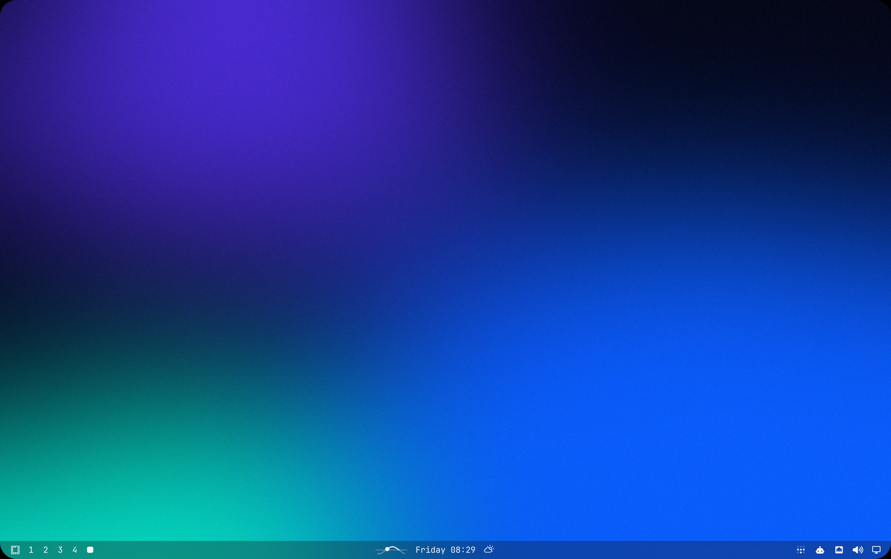

<div align="center">


# omarchy-sun-moon

**An Apple Watch style solar curve for the Omarchy bar: the sun's path over the day, with a dot where it is right now.**
For [Omarchy](https://omarchy.org) / Hyprland.

[](https://omarchy.org)
[](#how-it-works)
[](LICENSE)
[](README.de.md)


</div>

---

## What it shows



| | |
|---|---|
| ☀️ **Solar curve** | The sun's elevation over your local day, from midnight to midnight |
| ➖ **Horizon** | A thin line. Above it is daylight (bright curve), below it is night (dimmed curve) |
| ⚪ **Sun dot** | Where the sun is right now: filled during the day, hollow once it has set |
| 📍 **Your location** | Uses the location from the Omarchy weather widget, and follows it when you change it |
| 📦 **No dependencies** | Pure QML, no network, no API key. Everything is calculated locally |

The curve changes with the seasons: tall and wide in summer, flat and short in winter.

## Install

```bash
omarchy plugin add https://github.com/vsvito420/omarchy-sun-moon.git --enable
```

That clones it to `~/.config/omarchy/plugins/vsvito.sun-moon` and puts the widget in the centre of the bar.
To move it, for example right before the clock:

```bash
omarchy bar move vsvito.sun-moon --before omarchy.clock
```

Update with `omarchy plugin update vsvito.sun-moon`, remove with `omarchy plugin remove vsvito.sun-moon`.

## Location

The widget reads `latitude` and `longitude` from `~/.local/state/omarchy/settings/weather.json`, which is where the
Omarchy **weather** widget stores its location. Set your place there and the solar curve follows straight away.

Without a weather location it falls back to Berlin (52.52° N, 13.40° E).
To use a different fallback, change `latitude` / `longitude` at the top of `SunMoon.qml`.

## How it works

```
        ╭──●──╮            ● sun now (filled = day, hollow = night)
 ──────╯       ╰──────     horizon
 ╲___╱           ╲___╱     night part, dimmed
 0:00     12:00     24:00
```

- **Sun position:** the [USNO low-precision formula](https://aa.usno.navy.mil/faq/sun_approx), sampled 96 times over the day
  (every 15 minutes) and drawn with `QtQuick.Shapes`. The curve is split where it crosses the horizon.
- **Day or night:** the dot turns hollow once the sun is below −0.833°, the usual value that accounts for refraction.
- Refreshes every minute. Colours come from the bar, so it fits whatever Omarchy theme you use.

## Requirements

- Omarchy with the Quickshell based shell (bar widgets via `~/.config/omarchy/plugins/`)
- Works on a horizontal bar, top or bottom

## License

[MIT](LICENSE) © 2026 vsvito420
